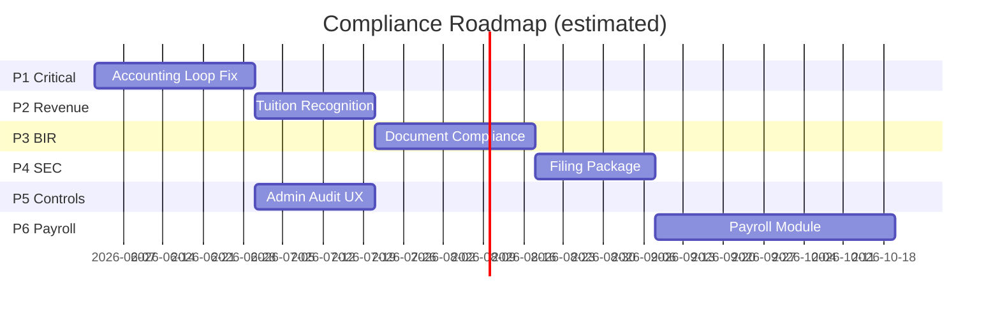

# Philippine School Accounting — Compliance Roadmap

**Document:** Implementation plan and roadmap  
**Date:** 2026-06-01  
**Status:** Approved for execution  
**Target:** Private Philippine schools (SEC/PFRS + BIR)  
**Out of scope:** DepEd/COA public-sector accounting (UACS, SAAOB, GAM)

---

## 1. Executive Summary

This roadmap closes the gap between the **current codebase** (solid GL core, PFRS-style reports, school-oriented COA) and **Philippine private-school industry standard** for day-to-day operations, CPA audit, SEC filing support, and BIR document compliance.

Work is organized into **six phases** over an estimated **20–28 weeks** (one team). Phases 1–3 are **blocking** for production use; Phases 4–5 are **regulatory filing** readiness; Phase 6 is **operational maturity**.

### Compliance targets

| Framework | Target state after roadmap |
|-----------|----------------------------|
| **SEC / PFRS** | Audit-ready AFS package: core statements + activity schedule + export |
| **BIR** | EOPT-aligned invoicing, exempt tuition handling, registered document fields |
| **Internal control** | Full GL integration, approval workflow, audit trail UI, period close |
| **DepEd / COA** | Not in scope — separate product if needed |

---

## 2. Current State (Baseline)

### Strengths

- Double-entry posting engine with balance validation and period gating
- PFRS-named financial statements (SFP, SCI, SCE, SCF, trial balance) with CSV/XLSX export
- School-specific default COA (tuition, unearned tuition, enrollment deposits, statutory payables)
- Multi-entity schema-per-campus architecture
- Cash receipts/disbursements, fixed assets, bank reconciliation (partially complete)
- RBAC roles and audit log schema

### Critical gaps (must fix first)

| Gap | Impact |
|-----|--------|
| Fiscal periods not seeded | All posting fails (`ERR_FISCAL_PERIOD_NOT_FOUND`) |
| Student billing does not post to GL | AR/revenue misstated vs subsidiary ledger |
| Vendor AP invoices do not post to GL | Payables misstated |
| JE UI posts from `draft`; service requires `approved` | Manual JEs broken end-to-end |
| OR void = status only | No reversing entry — audit failure |
| BIR fields on OR never populated | BIR document non-compliance |
| No EOPT Invoice support | Pre-2024 OR-centric model |
| No SEC activity schedule | SRC Rule 68 filing incomplete |
| Payroll / budgeting absent | ~60–70% of school expenses unaddressed |
| Minimal test coverage | 3 unit tests only |

**Reference:** Prior compliance assessment (2026-06-01) and `docs/superpowers/specs/2026-06-01-school-accounting-design.md`.

---

## 3. Guiding Principles

1. **GL is source of truth** — Every subledger transaction (AR, AP, CM, CD, FA) must post balanced journal entries.
2. **Regulatory rules in config** — Tax rates, document templates, and account mappings live in entity settings, not hardcoded logic.
3. **Revenue follows PFRS** — Bill to Unearned Tuition; recognize over the term (school industry norm).
4. **Minimal scope per task** — Fix broken loops before new features.
5. **Test posting paths** — Each phase adds Vitest coverage for new posting workflows.

---

## 4. Phase Overview

| Phase | Name | Duration | Outcome |
|-------|------|----------|---------|
| **1** | Accounting Loop Fix | 3–4 weeks | System can run a full billing → payment → report cycle |
| **2** | School Revenue Recognition | 2–3 weeks | PFRS-aligned tuition and deposit accounting |
| **3** | BIR Document Compliance | 3–4 weeks | EOPT Invoice, exempt tuition, document registry |
| **4** | SEC Filing Support | 2–3 weeks | Activity schedule + AFS export package |
| **5** | Controls & Admin UX | 2–3 weeks | Approvals, audit log, fiscal close, user admin |
| **6** | Payroll & Budget (optional) | 5–6 weeks | Statutory deductions, budget vs actual |

Phases 5 can **overlap** with Phases 2–4 after Phase 1 completes.

---

## 5. Phase 1 — Accounting Loop Fix (Critical)

**Goal:** Make the system operational for a private school's core accounting cycle.

### 5.1 Fiscal calendar bootstrap

**Problem:** `postingEngine` requires `public.fiscal_year` and `public.fiscal_period` rows; seed script does not create them.

**Tasks:**

1. Extend `scripts/seed.ts` to create fiscal year + 12 monthly periods per entity from `entity.fiscalYearStart`.
2. Add `entity.service` hook: when a new entity is created, auto-generate fiscal year/periods.
3. Add API routes:
   - `GET/POST /api/v1/fiscal-years`
   - `GET/PATCH /api/v1/fiscal-periods`
   - `POST /api/v1/fiscal-periods/:id/close`
4. Add UI: `/settings/fiscal-periods` (list, close period, close year) — restrict to `super_admin` / `accountant`.

**Key files:**

- `scripts/seed.ts`
- `src/services/entity.service.ts`
- `src/lib/accounting/period-control.ts`
- `src/lib/accounting/posting-engine.ts`
- New: `src/app/api/v1/fiscal-years/`, `src/app/(dashboard)/settings/fiscal-periods/`

**Acceptance criteria:**

- [ ] Fresh `npm run db:seed` creates fiscal periods for `entity_main`
- [ ] Cash receipt post succeeds without manual DB inserts
- [ ] Posting to a closed period returns `ERR_PERIOD_CLOSED`

---

### 5.2 Student billing → GL posting

**Problem:** `studentAccountService.createInvoice()` inserts invoices only; design spec §5.2 expects Dr AR / Cr revenue (or unearned).

**Tasks:**

1. Create `src/lib/accounting/billing-engine.ts`:
   - Map `fee_type` lines to revenue accounts (`41100`, `41200`, `41300`, etc.)
   - Default: Dr `11210` AR-Students, Cr `21300` Unearned Tuition (Phase 2 will add recognition)
   - Alternative config flag: direct revenue recognition for short programs
2. On invoice create: insert JE (`source_module='AR'`), post via `postingEngine`, link `student_invoice.journal_entry_id`
3. On invoice void/cancel: reversing entry
4. Add UI on student detail page: create invoice form (fee lines, term, due date)
5. Bulk billing API (optional in Phase 1): `POST /api/v1/student-accounts/bulk-invoice`

**Key files:**

- `src/services/student-account.service.ts`
- `src/lib/entity-schema.ts` (add `journal_entry_id` to `student_invoice` if missing)
- `src/app/(dashboard)/student-accounts/[id]/page.tsx`

**Acceptance criteria:**

- [ ] Creating invoice produces posted JE; trial balance shows AR and Unearned Tuition movement
- [ ] Payment application reduces invoice balance and posts Dr Cash / Cr AR
- [ ] AR subsidiary total matches GL account `11210`

---

### 5.3 Vendor AP → GL posting

**Problem:** Vendor invoices update balances only.

**Tasks:**

1. Create `src/lib/accounting/ap-engine.ts`:
   - Dr expense or asset account (from invoice line or vendor default)
   - Cr `21110` AP-Trade
2. Post on vendor invoice create; link `vendor_invoice.journal_entry_id`
3. Cash disbursement against AP: Dr AP, Cr Cash (extend `cash-disbursements.service.ts`)
4. Add vendor detail page with invoice create/list

**Key files:**

- `src/services/vendor-account.service.ts`
- `src/services/cash-disbursements.service.ts`
- New: `src/app/(dashboard)/vendor-accounts/[id]/page.tsx`

**Acceptance criteria:**

- [ ] Vendor invoice posts to GL; AP balance matches subsidiary ledger
- [ ] Disbursement against vendor invoice clears AP correctly

---

### 5.4 Journal entry approval workflow

**Problem:** UI allows post from `draft`; `journalEntryService.post()` requires `approved`.

**Tasks:**

1. Add API routes:
   - `POST /api/v1/journal-entries/:id/submit`
   - `POST /api/v1/journal-entries/:id/approve`
   - `POST /api/v1/journal-entries/:id/reject`
2. Update JE detail UI: show status pipeline `draft → pending_approval → approved → posted`
3. Wire `approval-engine.ts` for entries above configurable threshold
4. Align `postingEngine` direct post (CM/CD modules) to auto-approve or bypass approval for system-generated entries

**Key files:**

- `src/services/journal-entry.service.ts`
- `src/lib/accounting/approval-engine.ts`
- `src/app/(dashboard)/journal-entries/[id]/page.tsx`

**Acceptance criteria:**

- [ ] Manual JE: create → submit → approve → post works in UI
- [ ] Cash receipt post still works without manual approval step
- [ ] Auditor role cannot post or approve

---

### 5.5 Void and reversal integrity

**Tasks:**

1. OR void: call `postingEngine.reverse()` on linked JE; set OR status `void` with reason
2. Payment void: reverse CM entry, restore invoice balance
3. JE void: use existing `journalEntryService.reverse()`
4. Audit log all void/reversal actions

**Key files:**

- `src/app/api/v1/official-receipts/[id]/void/route.ts`
- `src/services/cash-receipts.service.ts`
- `src/lib/accounting/posting-engine.ts`

**Acceptance criteria:**

- [ ] Voiding OR creates offsetting JE; GL net effect is zero
- [ ] Void action appears in audit log

---

### Phase 1 exit gate

Run end-to-end scenario:

1. Seed DB → fiscal periods exist  
2. Create student → bill tuition → AR/Unearned on trial balance  
3. Record payment → OR issued → AR cleared  
4. Create vendor invoice → pay via disbursement → AP cleared  
5. Generate trial balance, income statement, balance sheet — all balanced  

---

## 6. Phase 2 — School Revenue Recognition

**Goal:** Align with PFRS practice for tuition (deferred/unearned revenue earned over the school term).

### 6.1 Unearned tuition workflow

**Tasks:**

1. Entity setting: `revenue_recognition_method` = `term_straight_line` | `immediate`
2. On billing (Phase 1): always Cr `21300` Unearned Tuition when method = `term_straight_line`
3. Scheduled/on-demand recognition job:
   - Dr `21300`, Cr `41100`/`41200`/`41300` per fee type
   - Prorate by days in term or monthly for K-12 vs college
4. API: `POST /api/v1/revenue-recognition/run` (manual trigger + cron-ready)
5. Report: Unearned Tuition roll-forward schedule

**Key files:**

- New: `src/lib/accounting/revenue-recognition-engine.ts`
- New: `src/services/revenue-recognition.service.ts`
- `src/lib/entity-schema.ts` (entity settings table or JSONB on entity)

**Acceptance criteria:**

- [ ] SY billing posts to Unearned; monthly recognition moves to Tuition Revenue
- [ ] Income statement reflects earned revenue only for the period
- [ ] Roll-forward report reconciles opening + billing − recognition = closing Unearned

---

### 6.2 Enrollment deposits

**Tasks:**

1. Payment type `enrollment_deposit`: Dr Cash, Cr `21800` Deferred Revenue - Enrollment Deposits
2. On enrollment confirmation: Dr `21800`, Cr `21300` or apply to first invoice
3. UI: deposit receipt separate from tuition payment

**Acceptance criteria:**

- [ ] Deposits never hit revenue until enrollment confirmed
- [ ] Refunded deposits post Dr `21800`, Cr Cash

---

### 6.3 AR aging and collections

**Tasks:**

1. Page: `/reports/ar-aging` using existing `studentAccountService.getAging()`
2. Export CSV/XLSX
3. Student statement of account (invoice + payment history PDF)

**Acceptance criteria:**

- [ ] Aging buckets: current, 1–30, 31–60, 61–90, 91+ days
- [ ] Totals tie to AR GL balance

---

## 7. Phase 3 — BIR Document Compliance

**Goal:** Meet current BIR invoicing rules (EOPT / RR 7-2024) for private schools.

### 7.1 Document model update (EOPT)

**Context:** Under EOPT, **Invoice** is the principal tax document for services; OR is supplementary.

**Tasks:**

1. Rename/extend schema:
   - Add `sales_invoice` table (or generalize `official_receipt` → `tax_document` with `document_type`: `invoice` | `official_receipt` | `acknowledgment_receipt`)
   - Mandatory fields per RR 7-2024 §6(B): TIN, business name, address, description, amount, date, VAT breakdown
2. Entity settings: BIR TIN, business name, address, ATP serial range, accredited printer TIN, permit number
3. Migrate cash receipt flow: issue **Invoice** (VAT-exempt for tuition) + optional supplementary OR
4. Print/PDF template with BIR-required layout

**Key files:**

- `src/lib/entity-schema.ts`
- `src/services/cash-receipts.service.ts`
- New: `src/lib/bir/document-templates.ts`
- New: `src/lib/export/invoice-pdf.ts`

**Acceptance criteria:**

- [ ] Tuition payment generates VAT-exempt Invoice with all mandatory fields
- [ ] Document numbers are sequential per entity/fiscal year
- [ ] Entity BIR settings configurable without code change

---

### 7.2 VAT and tax configuration

**Tasks:**

1. Fee-type tax profile: `vat_exempt` | `vatable` | `zero_rated` (default tuition = exempt)
2. VATable ancillary sales (books, uniforms): compute 12% output VAT, post Dr AR, Cr Revenue, Cr `21900` Output VAT
3. Input VAT on disbursements (optional): tag vendor invoices as vatable
4. Percentage tax account and logic for non-VAT entities (design spec mentions percentage tax — add `21450` Percentage Tax Payable if needed)

**Acceptance criteria:**

- [ ] VAT-exempt tuition never accrues output VAT
- [ ] VATable sale produces correct JE split
- [ ] Tax config stored per entity, not hardcoded

---

### 7.3 Withholding tax (expanded)

**Tasks:**

1. Expand CD module: EWT types (professional fees, rent, etc.) with rates from config
2. Track `2307`-equivalent data: payee TIN, ATC, base, tax withheld
3. Report: monthly withholding summary (data export for BIR 0619-E / 1601-E preparation — not auto-filing)

**Acceptance criteria:**

- [ ] Disbursement with WHT posts Dr Expense, Dr WHT Receivable (or Cr WHT Payable), Cr Cash
- [ ] Withholding register exportable by period

---

## 8. Phase 4 — SEC Filing Support

**Goal:** Support CPA audit and SEC Revised SRC Rule 68 submissions for non-stock schools.

### 8.1 Activity schedule (SRC Rule 68)

**Required:** Schedule of receipts and disbursements by source and activity.

**Tasks:**

1. Map COA accounts to activity categories:
   - Receipts: tuition, misc fees, grants, donations, other
   - Disbursements: salaries, utilities, supplies, depreciation, etc.
2. Report: `/reports/activity-schedule` with period filter
3. Export PDF/XLSX formatted for SEC supplementary filing

**Key files:**

- New: `src/lib/accounting/activity-schedule.ts`
- New: `src/app/(dashboard)/reports/activity-schedule/page.tsx`

**Acceptance criteria:**

- [ ] Total receipts = total revenue + non-revenue receipts on SCI/SCE
- [ ] Total disbursements = total expenses + asset purchases + debt payments
- [ ] Export matches SEC schedule structure

---

### 8.2 AFS export package

**Tasks:**

1. "Generate AFS Package" action: bundles SFP, SCI, SCE, SCF, trial balance, activity schedule, notes template
2. Notes to FS template (Word/PDF): accounting policies checklist (PFRS for SMEs), significant estimates placeholders
3. Comparative prior-year columns (already partially supported)
4. Entity footers: registered name, SEC reg number, TIN

**Acceptance criteria:**

- [ ] Single export produces all statements for a fiscal year
- [ ] CPA can import XLSX into working papers with minimal rework

---

## 9. Phase 5 — Controls & Admin UX

**Goal:** Internal control and operability expected by auditors and finance teams.

### 9.1 Admin module

**Tasks:**

1. Implement `/admin` pages (currently 404):
   - User management (CRUD, role assignment, entity assignment)
   - Entity settings (TIN, BIR, fiscal year start, revenue recognition method)
   - Number series management (JE, OR, Invoice, CV, CD)
2. API routes for users (permissions already defined in seed)

---

### 9.2 Audit trail UI

**Tasks:**

1. `GET /api/v1/admin/audit-log` with filters: date, user, action, entity, module
2. Page: `/admin/audit-log` (read-only, `auditor` + `super_admin`)

---

### 9.3 Approval inbox

**Tasks:**

1. UI: `/approvals` — pending JEs and disbursements
2. Email/notification (optional): in-app badge on sidebar

---

### 9.4 Dashboard and entity selection

**Tasks:**

1. Replace dashboard `--` placeholders with real KPIs: cash balance, AR total, AP total, monthly revenue
2. Implement `/select-entity` + `POST /api/v1/auth/select-entity` (referenced in AGENTS.md but missing)

---

### Phase 5 acceptance criteria

- [ ] Super admin can create users and assign roles
- [ ] Auditor can search audit log without DB access
- [ ] Dashboard shows live balances from GL

---

## 10. Phase 6 — Payroll & Budget (Recommended, Separate Milestone) **[DONE]**

**Goal:** Cover the largest expense category and standard school budget monitoring.

> Payroll is explicitly out of scope in the original design spec §11. This phase is **recommended** for full industry parity but can be deferred or replaced by a GL import from an external payroll system.

### 10.1 Payroll module (minimum viable) **[DONE]**

**Tasks:**

1. [x] Employee master (accounting-relevant: TIN, SSS, PhilHealth, Pag-IBIG numbers)
2. [x] Pay run: basic pay, allowances, deductions (SSS, PhilHealth, Pag-IBIG, WHT)
3. [x] Posting: Dr `51100` Salaries, Dr `52000` Contributions, Cr `21600`/`21700` payables, Cr `11120` Cash (on payment)
4. [x] 13th month accrual (`52100`, `21700`)
5. [x] Payslip HTML (printable PDF) + payroll register export (CSV/XLS)

**Files created:**
- `src/lib/accounting/payroll-engine.ts` — PH contribution tables (SSS, PhilHealth, Pag-IBIG, WHT)
- `src/services/payroll.service.ts` — Employee CRUD, pay run generation, GL posting
- `src/app/api/v1/employees/` — Employee API routes
- `src/app/api/v1/payroll-runs/` — Pay run API routes
- `src/app/(dashboard)/payroll/page.tsx` — Payroll dashboard page
- `entity-schema.ts` — `employee`, `payroll_run`, `payroll_run_line` tables
- `src/lib/payroll-export.ts` — Payslip HTML generation + payroll register CSV/XLS export
- `src/app/api/v1/payroll-runs/[id]/payslip/route.ts` — Payslip HTML endpoint
- `src/app/api/v1/payroll-runs/[id]/register/route.ts` — Payroll register export endpoint

---

### 10.2 Budget vs actual **[DONE]**

**Tasks:**

1. [x] Annual budget by account per fiscal year
2. [x] Report: budget vs actual with variance and % variance
3. [ ] Optional: encumbrance on AP/commitment (advanced, deferred)

**Files created:**
- `src/lib/accounting/budget-engine.ts` — Budget vs actual calculation engine
- `src/services/budget.service.ts` — Budget CRUD and comparison service
- `src/app/api/v1/budgets/` — Budget API routes
- `src/app/api/v1/budgets/compare/route.ts` — Budget vs actual comparison
- `src/app/(dashboard)/budget-vs-actual/page.tsx` — Budget vs actual page
- `entity-schema.ts` — `budget` table

---

## 11. Cross-Cutting Work (All Phases)

### 11.1 Testing strategy

| Layer | Target |
|-------|--------|
| Unit | Posting engines, revenue recognition, tax calculation, depreciation |
| Integration | API routes: invoice → post → report balance |
| E2E | Playwright: login → bill → pay → run trial balance |

**Minimum by Phase 1 exit:** 20+ unit tests on posting paths; 5+ integration tests.

**Commands:** `npm run test:run`, add `npm run test:integration` when ready.

---

### 11.2 Data migration for existing deployments

If entities already have unposted invoices:

1. Migration script: backfill JEs for open invoices and unpaid AP
2. Reconciliation report before/after

---

### 11.3 Documentation updates

After each phase:

- Update `AGENTS.md` with new routes and known fixes
- Add `docs/USER-GUIDE.md` for finance staff workflows
- Keep this roadmap checklist updated (mark completed items)

---

## 12. Priority Matrix

| Priority | Item | Phase |
|----------|------|-------|
| P0 | Fiscal period seeding | 1 |
| P0 | Billing → GL | 1 |
| P0 | AP → GL | 1 |
| P0 | JE approval fix | 1 |
| P0 | Void/reversal | 1 |
| P1 | Unearned tuition recognition | 2 |
| P1 | AR aging report | 2 |
| P1 | BIR Invoice (EOPT) | 3 |
| P1 | VAT-exempt tuition defaults | 3 |
| P2 | SEC activity schedule | 4 |
| P2 | AFS export package | 4 |
| P2 | Audit log UI | 5 |
| P2 | User admin | 5 |
| P3 | Payroll module | 6 |
| P3 | Budget vs actual | 6 |

---

## 13. Success Metrics

| Metric | Target |
|--------|--------|
| Trial balance | Always balanced after any workflow |
| AR/AP subsidiary = GL | Zero unexplained variance |
| Posting failure rate | < 0.1% with valid fiscal period |
| Statement generation | < 5s for 100k posted lines (entity) |
| Test coverage (posting lib) | ≥ 80% line coverage |
| CPA sign-off readiness | Phase 1–4 complete + external review |

---

## 14. Risks & Mitigations

| Risk | Mitigation |
|------|------------|
| BIR rules change again | Tax rules in entity config; version document templates |
| Revenue recognition disputes | Make method configurable; document in notes template |
| Payroll scope creep | Phase 6 optional; support CSV JE import as interim |
| Multi-entity migration complexity | Phase scripts iterate all `entity.schema_name` values |
| Performance at 100k txns/month | Index GL tables; batch revenue recognition job |

---

## 15. Out of Scope (Explicit)

- DepEd / COA / UACS / SAAOB public-sector reporting
- Full BIR e-filing automation (1701, 0619-E, etc.) — export only
- Student Information System (enrollment, grades, class scheduling)
- Inventory and procurement / PO system
- Consolidated multi-entity group reporting
- CAS/PTU BIR accreditation process (documentation support only)

---

## 16. Suggested Execution Order (Sprint Plan)

| Sprint | Weeks | Deliverable |
|--------|-------|-------------|
| S1 | 1–2 | Fiscal seed + API + billing GL posting |
| S2 | 3–4 | AP GL + JE approval + void/reversal + E2E test |
| S3 | 5–6 | Revenue recognition + enrollment deposits |
| S4 | 7–8 | AR aging + student/vendor UI completion |
| S5 | 9–10 | BIR document model + Invoice PDF |
| S6 | 11–12 | VAT config + WHT register |
| S7 | 13–14 | SEC activity schedule + AFS package |
| S8 | 15–16 | Admin, audit log, dashboard, entity picker |
| S9+ | 17+ | Payroll + budget (if approved) |

---

## 17. Checklist Tracker

Use this section to track progress. Update status as work completes.

### Phase 1
- [x] 5.1 Fiscal calendar bootstrap
- [x] 5.2 Student billing → GL
- [x] 5.3 Vendor AP → GL
- [x] 5.4 JE approval workflow
- [x] 5.5 Void and reversal integrity
- [ ] Phase 1 exit gate passed

### Phase 2
- [x] 6.1 Unearned tuition workflow
- [x] 6.2 Enrollment deposits
- [x] 6.3 AR aging and collections

 ### Phase 3
  - [x] 7.1 Document model (EOPT Invoice)
  - [x] 7.2 VAT and tax configuration
  - [x] 7.3 Withholding tax (expanded)

### Phase 4
  - [x] 8.1 Activity schedule
  - [x] 8.2 AFS export package

  ### Phase 5
  - [x] 9.1 Admin module
  - [x] 9.2 Audit trail UI
  - [x] 9.3 Approval inbox
  - [x] 9.4 Dashboard and entity selection

### Phase 6 (optional) **[DONE]**
- [x] 10.1 Payroll module
- [x] 10.2 Budget vs actual
- [x] 10.1.1 Payslip PDF & payroll register export (Phase 6.1)
- [ ] 10.2.1 Encumbrance on AP/commitment (advanced)

---

## 18. References

- `docs/superpowers/specs/2026-06-01-school-accounting-design.md` — Original system design
- SEC Revised SRC Rule 68 — General Financial Reporting Requirements
- BIR RR No. 7-2024 / RMC No. 77-2024 — EOPT invoicing
- PFRS for SMEs / PFRS for Small Entities — Financial reporting framework
- Prior compliance assessment — 2026-06-01 codebase review

---

*This document is the authoritative roadmap for Philippine private-school compliance work. Implementation plans in `docs/superpowers/plans/` cover original phase 1–5 build-out; this roadmap supersedes them for compliance and production-readiness priorities.*
